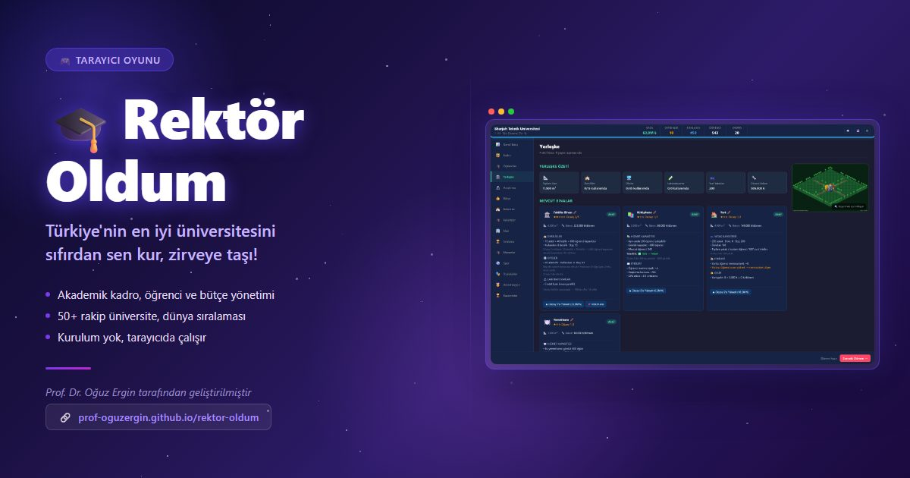

# 🎓 Rektör Oldum

[](https://prof-oguzergin.github.io/rektor-oldum/)

> **Bir üniversiteyi sıfırdan kurup dünya sıralamasında zirveye taşı.**  
> Tarayıcında çalışır, kurulum yok.

## 🎮 Hemen Oyna

<p align="center">
  <a href="https://prof-oguzergin.github.io/rektor-oldum/">
    
  </a>
</p>

**[https://prof-oguzergin.github.io/rektor-oldum/](https://prof-oguzergin.github.io/rektor-oldum/)**

Akademik kadro, öğrenci, bütçe, yerleşke, araştırma projesi yönetimi, 50+ rakip üniversite. Football Manager tarzı üniversite simülasyonu.

## 📖 Hakkında

Bu oyun, bir üniversite rektörü olarak akademik kurumunuzu yönetmenizi sağlayan ayrıntılı bir simülasyon oyunudur. Football Manager'ın üniversite versiyonu olarak düşünebilirsiniz.

### Temel Özellikler

🏛️ **Akademik Yönetim**
- Fakülte ve bölüm yapılanması
- Müfredat ve ders programı yönetimi
- Lisans, yüksek lisans ve doktora programları
- Yeni bölüm ve program açma (YÖK onayı)

👨‍🏫 **Kadro Yönetimi (FM Tarzı)**
- Hoca transferi ve açık kadro ilanları
- Uzmanlık alanları ve ders ataması
- Bölüm başkanı ve dekan ataması
- Maaş baremi, ödüllendirme, unvan yükseltme
- SVG tabanlı benzersiz hoca avatarları

🎓 **Öğrenci Sistemi**
- Kontenjan belirleme (burslu/yarı burslu/ücretli)
- YKS sıralamasına göre öğrenci kalitesi
- 4 sınıf düzeyi, yatay geçiş, mezuniyet
- Yıldız öğrenci keşfi
- Memnuniyet kırılımı (9 faktör)

🔬 **Araştırma**
- TÜBİTAK, AB Horizon, Sanayi İşbirliği projeleri
- Hocalar otomatik başvurur, sonuçları izlersiniz
- BAP (üniversite içi proje) çağrıları
- Yayın, atıf, h-indeks takibi

🏗️ **Yerleşke ve Altyapı**
- Bina inşaatı ve düzey yükseltme
- m² bazlı alan ve kapasite yönetimi
- Derslik, ofis, laboratuvar ataması
- İdari birimler (10 birim, düzey sistemi)

💰 **Ekonomi**
- Devlet / Vakıf / ABD üniversite modelleri
- Gelir-gider yönetimi
- Proje gelirleri, bağışlar, sponsorluklar

📊 **Sıralama ve Rekabet**
- 50+ rakip üniversite
- Çok boyutlu sıralama sistemi
- YKS ortalaması, yayın, hoca karşılaştırması

### Oyun Modelleri

| Model | Gelir Kaynağı | Ücret | Maaş |
|-------|--------------|-------|------|
| 🇹🇷 Devlet | Devlet bütçesi | Ücretsiz | Sabit barem |
| 🇹🇷 Vakıf | Öğrenci ücreti + fon | Ücretli | Esnek |
| 🇺🇸 ABD | Yüksek ücret + bağış | Çok yüksek | Piyasa |

## 🛠️ Teknoloji

- Saf HTML + CSS + JavaScript (ES Modules)
- Hiçbir framework veya bağımlılık yok
- Tarayıcıda çalışır (Chrome, Firefox, Edge, Safari)

## 🚀 Yerel Kurulum

```bash
git clone https://github.com/prof-oguzergin/rektor-oldum.git
cd rektor-oldum
npx serve
# veya python -m http.server 8000
```

Tarayıcıda `http://localhost:3000` (veya `8000`) adresine gidin.

## 🤝 Katkıda Bulunma

Katkılarınızı bekliyoruz!

1. Fork edin
2. Feature branch oluşturun (`git checkout -b feature/yeni-ozellik`)
3. Commit yapın (`git commit -m 'Yeni özellik eklendi'`)
4. Push edin (`git push origin feature/yeni-ozellik`)
5. Pull Request açın

### Öncelikli İhtiyaçlar
- 🎨 UI/UX iyileştirmeleri
- 🌐 İngilizce çeviri
- 🐛 Hata düzeltmeleri
- 📱 Mobil uyumluluk
- 🎵 Ses efektleri ve müzik

## 📄 Lisans

MIT License — Dilediğiniz gibi kullanabilirsiniz.

## 👨‍💻 Geliştirici

Prof. Dr. Oğuz Ergin · [TOBB ETÜ](https://www.etu.edu.tr)

Claude Code (Anthropic) ile geliştirilmiştir.

---

*Bu oyun eğitim amaçlı geliştirilmiştir. Gerçek üniversite yönetimi çok daha karmaşıktır!* 😄
